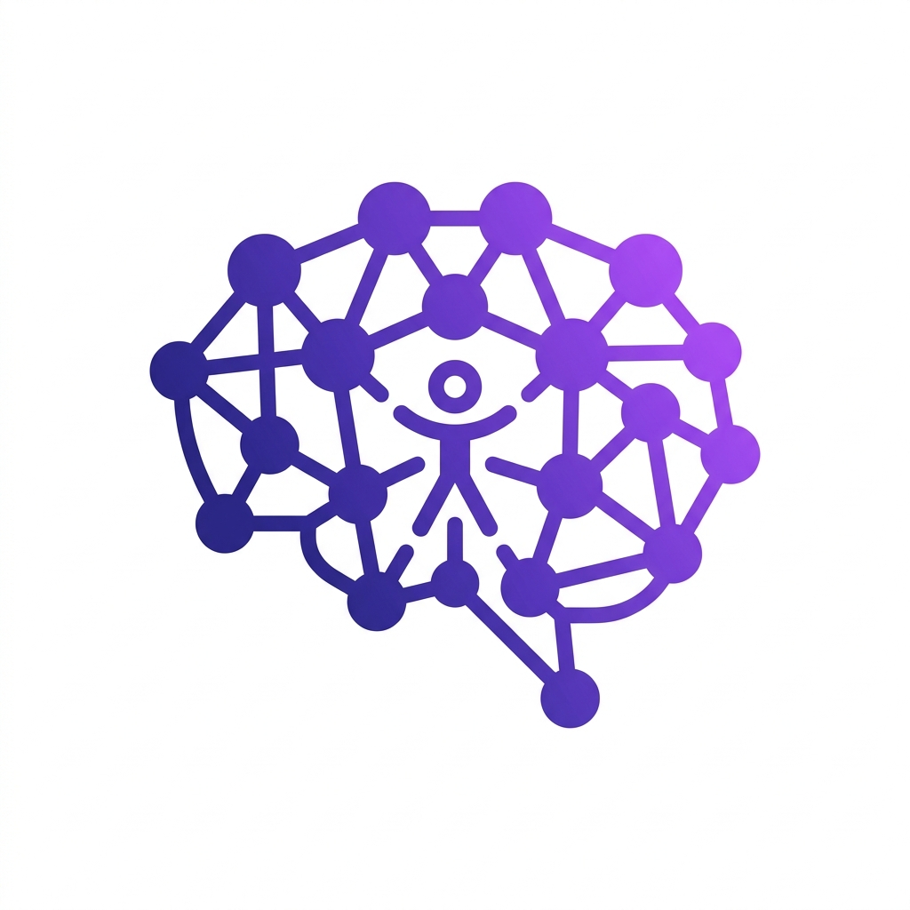
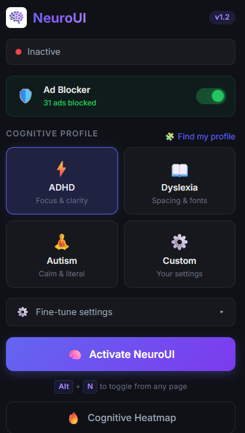
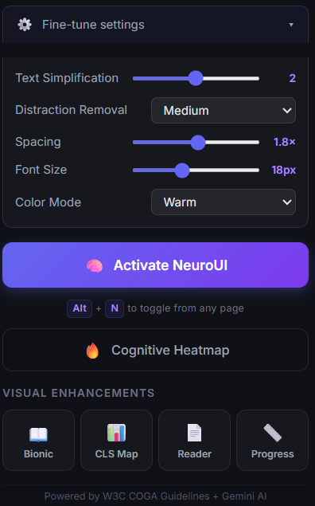
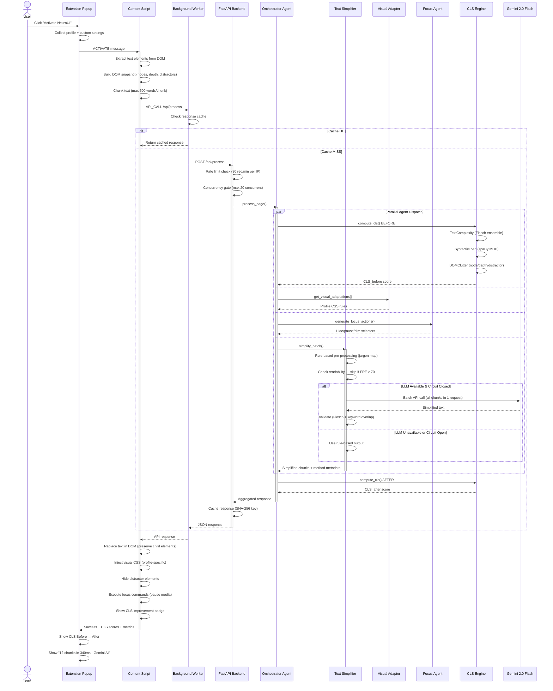
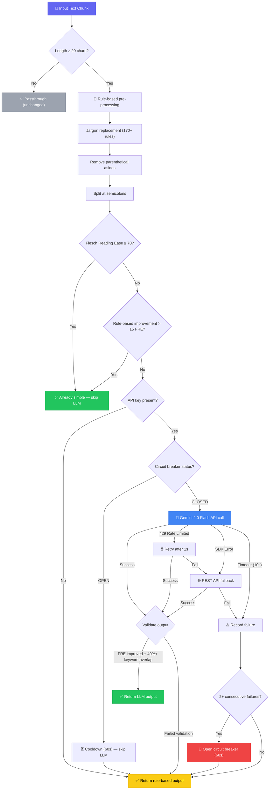

<p align="center">
  
</p>

<h1 align="center">NeuroUI — Cognitive Accessibility Engine</h1>

<p align="center">
  <strong>AI-powered browser extension that dynamically adapts web content to reduce cognitive load for neurodivergent users.</strong>
</p>

<p align="center">
  
  
  
  
  
</p>

<p align="center">
  <em>Built for ADHD · Dyslexia · Autism · Custom profiles</em>
</p>

---

## 👀 See It In Action

<p align="center">
  
  &nbsp;&nbsp;&nbsp;&nbsp;
  
</p>

<p align="center">
  <sub><b>Left:</b> Profile selection with ADHD/Dyslexia/Autism/Custom modes, ad blocker stats, and one-click activation</sub><br/>
  <sub><b>Right:</b> Fine-tune controls — text simplification level, spacing, font size, color mode, and visual enhancements (Bionic Reading, CLS Map, Reader Mode, Progress Bar)</sub>
</p>

---

## 🧠 What is NeuroUI?

NeuroUI is a **research-grade Multi-Agent System (MAS)** that intercepts, analyzes, and restructures web content in real-time to make the internet more accessible for neurodivergent users. It combines LLM-powered text simplification with deterministic visual transformations grounded in peer-reviewed cognitive science research.

Unlike traditional accessibility tools that apply static CSS overrides, NeuroUI **understands content** — it measures cognitive load, simplifies language, removes distractions, and adapts the visual presentation to each user's specific cognitive profile.

### ✨ Key Features

| Feature | Description |
|---------|-------------|
| 🤖 **AI Text Simplification** | Gemini 2.0 Flash rewrites complex text following profile-specific linguistic rules |
| 📊 **Cognitive Load Score (CLS)** | Novel composite metric: `CLS = 0.4×TextComplexity + 0.3×SyntacticLoad + 0.3×DOMClutter` |
| 🔥 **Cognitive Heatmap** | Per-paragraph CLS visualization with color-coded difficulty levels |
| 🛡️ **3-Layer Ad Blocker** | Network-level blocking + CSS cosmetic filtering + DOM distractor removal |
| 📖 **Bionic Reading** | Bold-first-half typography for guided reading (ADHD-optimized) |
| 📄 **Reader Mode** | Distraction-free Zen layout with theme switching (Dark/Sepia/Light) |
| 📏 **Reading Progress Bar** | Visual scroll progress indicator |
| 📊 **CLS Scroll Minimap** | Scrollbar-mounted cognitive difficulty heatmap |
| 🧩 **Onboarding Quiz** | 6-question assessment to auto-detect optimal cognitive profile |
| ⌨️ **Keyboard Shortcut** | `Alt+N` to toggle from any page |
| ⚡ **Processing Metrics** | Real-time display of chunks processed, latency, and AI method used |

---

## 🏗️ Architecture

```
┌─────────────────────────────────────────────────────────────────┐
│                    Chrome Extension (MV3)                       │
│  ┌──────────┐  ┌───────────────┐  ┌──────────────────────────┐ │
│  │ popup.js │  │ background.js │  │   content_script.js      │ │
│  │ (UI)     │←→│ (API Bridge)  │←→│ (DOM Engine)             │ │
│  └──────────┘  └───────┬───────┘  │ • Text extraction        │ │
│                        │          │ • DOM snapshot            │ │
│                        │          │ • CSS injection           │ │
│                        │          │ • Visual features         │ │
│                        │          │ • Bionic / Reader / etc.  │ │
│                        │          └──────────────────────────┘ │
│  ┌──────────────────────────────────────────────────────────┐  │
│  │ ad_blocker.js — Cosmetic filtering + MutationObserver    │  │
│  └──────────────────────────────────────────────────────────┘  │
└────────────────────────┬────────────────────────────────────────┘
                         │ REST API (JSON)
                         ▼
┌─────────────────────────────────────────────────────────────────┐
│                    FastAPI Backend                               │
│  ┌──────────────────────────────────────────────────────────┐   │
│  │                   Orchestrator Agent                      │   │
│  │         (Parallel dispatch + 15s hard timeout)            │   │
│  └──────┬──────────────┬──────────────────┬─────────────────┘   │
│         ▼              ▼                  ▼                     │
│  ┌─────────────┐ ┌──────────────┐ ┌─────────────────┐          │
│  │    Text      │ │   Visual     │ │     Focus       │          │
│  │ Simplifier   │ │  Adapter     │ │     Agent       │          │
│  │             │ │              │ │                 │          │
│  │ • Rule-based │ │ • ADHD CSS   │ │ • Ad detection  │          │
│  │ • Gemini LLM │ │ • Dyslexia   │ │ • Popup removal │          │
│  │ • Batch API  │ │ • Autism     │ │ • Animation     │          │
│  │ • Circuit    │ │ • Custom     │ │   pause         │          │
│  │   breaker    │ │ • Overrides  │ │ • Cookie banner │          │
│  └─────────────┘ └──────────────┘ └─────────────────┘          │
│         │                                                       │
│  ┌──────▼──────────────────────────────────────────────────┐    │
│  │               Core Engine                                │    │
│  │  • Cognitive Metrics (CLS computation)                   │    │
│  │  • DOM Analyzer (distractor classification)              │    │
│  │  • Response cache + Rate limiter + Circuit breaker       │    │
│  └──────────────────────────────────────────────────────────┘    │
└─────────────────────────────────────────────────────────────────┘
```

### 🔄 Complete Workflow — User Click to DOM Transformation



### 🤖 Text Simplification Decision Flow



---

## 🔬 The Science Behind CLS

The **Cognitive Load Score** is a novel composite metric combining three research-backed dimensions:

| Component | Weight | Source | What It Measures |
|-----------|--------|--------|------------------|
| **Text Complexity** | 40% | Flesch (1948), Coleman-Liau | Ensemble of readability scores (Flesch Reading Ease + FK Grade + Coleman-Liau) |
| **Syntactic Load** | 30% | Gibson (2000) Dependency Locality Theory | Mean Dependency Distance via spaCy parse trees — processing cost scales with word-gap distance |
| **DOM Clutter** | 30% | Harper et al. (2009) | Node count, nesting depth, distractor elements, animation density |

**Profile-specific system prompts** ensure genuinely different transformations:
- **ADHD**: Max 15-word sentences, bold key takeaways, bullet points, inverted pyramid
- **Dyslexia**: Anglo-Saxon vocabulary, no similar-shape words, one idea per line
- **Autism**: Zero idioms/metaphors, consistent terminology, explicit cultural references

---

## 🚀 Quick Start

### Prerequisites
- **Python 3.11+**
- **Google Chrome** (or Chromium-based browser)
- **Gemini API key** (optional — falls back to rule-based simplification)

### 1. Backend Setup

```bash
# Clone the repository
git clone https://github.com/your-username/neuroui.git
cd neuroui/backend

# Create virtual environment
python -m venv venv
source venv/bin/activate  # Windows: venv\Scripts\activate

# Install dependencies
pip install -r requirements.txt
python -m spacy download en_core_web_sm

# Configure API key (optional)
cp .env.example .env
# Edit .env and add: GEMINI_API_KEY=your_key_here

# Start the server
uvicorn main:app --reload
```

The backend will be available at `http://localhost:8000`.

### 2. Extension Setup

1. Open Chrome → `chrome://extensions/`
2. Enable **Developer mode** (top right)
3. Click **Load unpacked** → select the `extension/` folder
4. Click the NeuroUI icon in the toolbar
5. Take the onboarding quiz or select a profile manually

### 3. Docker Deployment

```bash
# Build and run
cd backend
docker build -t neuroui-backend .
docker run -p 8000:8000 -e GEMINI_API_KEY=your_key neuroui-backend

# Or use Render (render.yaml included)
# Push to GitHub → connect to Render → auto-deploys
```

---

## 📡 API Endpoints

| Method | Endpoint | Description |
|--------|----------|-------------|
| `POST` | `/api/process` | Main MAS pipeline — text simplification + visual + focus |
| `POST` | `/api/heatmap` | Per-paragraph CLS scoring for heatmap visualization |
| `GET` | `/api/health` | Health check with LLM status |
| `GET` | `/api/stats` | Live server analytics (requests, latency, cache, profiles) |
| `GET` | `/api/profiles` | List available cognitive profiles |
| `GET` | `/docs` | Interactive Swagger UI documentation |

### Example: `/api/stats` Response
```json
{
  "uptime": "1h 23m 45s",
  "requests": {
    "total": 142,
    "cache_hits": 38,
    "cache_hit_rate": "26.8%",
    "rate_limited": 0
  },
  "performance": {
    "avg_latency_ms": 285.3
  },
  "profiles": { "adhd": 89, "dyslexia": 31, "autism": 22 },
  "methods": { "llm": 78, "rule_based": 64 },
  "system": {
    "circuit_breaker": "CLOSED",
    "llm_enabled": true
  }
}
```

---

## 🛡️ Resilience & Performance

NeuroUI is designed to **never fail visibly** — every failure gracefully degrades:

```
Gemini API call
  │
  ├─ Success → LLM-quality simplification
  │
  ├─ Rate limited (429) → Retry once after 1s
  │     └─ Still failing → REST API fallback
  │           └─ Still failing → Rule-based fallback
  │
  ├─ Timeout (10s) → Rule-based fallback
  │
  └─ 2+ consecutive failures → Circuit breaker OPENS
        └─ All requests go rule-based for 60s (instant response)
              └─ Cooldown expires → Try LLM again
```

| Protection Layer | What It Does |
|-----------------|--------------|
| **Per-IP Rate Limiter** | 30 requests/min per IP (sliding window) |
| **Concurrency Semaphore** | Max 20 concurrent `/api/process` calls |
| **Circuit Breaker** | Stops LLM calls after 2 failures, 60s cooldown |
| **Pipeline Timeout** | 15s hard ceiling for entire processing pipeline |
| **Response Cache** | SHA-256 content-addressed, 100-entry LRU |
| **Gzip Compression** | 60-80% payload reduction for API responses |
| **Multi-Worker** | 2 uvicorn workers for parallel request handling |
| **Docker HEALTHCHECK** | Auto-restart unhealthy containers |

---

## 📁 Project Structure

```
neuroui/
├── backend/                    # FastAPI Multi-Agent System
│   ├── main.py                 # API endpoints, rate limiting, caching
│   ├── agents/
│   │   ├── orchestrator.py     # Orchestrator-Worker pattern coordinator
│   │   ├── text_simplifier.py  # Hybrid LLM + rule-based simplification
│   │   ├── visual_adapter.py   # Profile-specific CSS transformations
│   │   └── focus_agent.py      # Distraction detection & removal
│   ├── core/
│   │   ├── cognitive_metrics.py # CLS computation engine
│   │   └── dom_analyzer.py     # DOM distractor classification
│   ├── Dockerfile              # Production container with health checks
│   ├── requirements.txt
│   └── .env.example
│
├── extension/                  # Chrome Extension (Manifest V3)
│   ├── manifest.json           # Extension config, permissions, shortcuts
│   ├── popup.html/css/js       # Extension UI with premium dark theme
│   ├── content_script.js       # DOM transformation engine
│   ├── background.js           # API bridge + caching layer
│   ├── ad_blocker.js           # Cosmetic ad filtering + MutationObserver
│   ├── onboarding.html/css/js  # 6-question cognitive profile quiz
│   └── rules/
│       └── ad_block_rules.json # declarativeNetRequest ad blocking rules
│
└── render.yaml                 # One-click Render deployment
```

---

## 🧪 Testing

```bash
cd backend

# Run all tests
pytest test_all.py -v

# Quick integration test
python quick_test.py

# Manual API test
curl -X POST http://localhost:8000/api/process \
  -H "Content-Type: application/json" \
  -d '{"chunks": ["The implementation of this methodology facilitates the amelioration of existing paradigms."], "profile": "adhd"}'
```

---

## 🔧 Configuration

### Environment Variables

| Variable | Required | Default | Description |
|----------|----------|---------|-------------|
| `GEMINI_API_KEY` | No | — | Google Gemini API key. Without it, only rule-based simplification is used |

### Extension Settings

All settings are accessible via the popup **Fine-tune settings** panel:

| Setting | Range | Description |
|---------|-------|-------------|
| Text Simplification | 1-3 | Aggressiveness of text rewriting |
| Distraction Removal | Low/Med/High | Controls distractor confidence threshold |
| Spacing | 0.5x - 3.0x | Letter, word, and line spacing multiplier |
| Font Size | 12-28px | Override base font size |
| Color Mode | Original/Muted/Warm/High Contrast | Color filter applied to page |

---

## 📚 Research References

1. **Flesch, R. (1948)**. A new readability yardstick. *Journal of Applied Psychology*
2. **Gibson, E. (2000)**. The Dependency Locality Theory. *Cognition, 68(1)*
3. **Harper, S. et al. (2009)**. Web content visual complexity. *ACM Transactions on the Web*
4. **W3C COGA Task Force (2021)**. Making Content Usable for People with Cognitive and Learning Disabilities. *W3C Working Group Note*
5. **Rello, L. & Baeza-Yates, R. (2013)**. Good fonts for dyslexia. *ACM ASSETS*
6. **Zorzi, M. et al. (2012)**. Extra-large letter spacing improves reading in dyslexia. *PNAS*

---

## 📄 License

This project was built for a hackathon. All rights reserved.

---

<p align="center">
  <sub>Built with ❤️ for neurodivergent users everywhere</sub>
</p>
